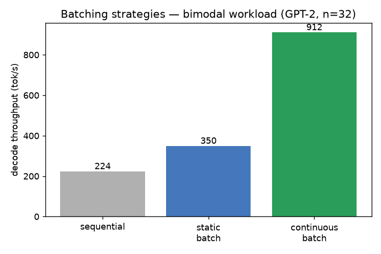
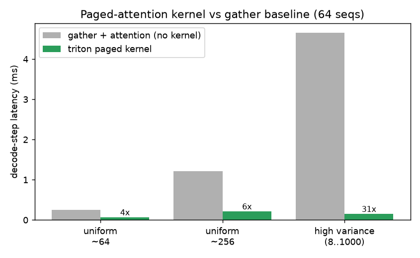
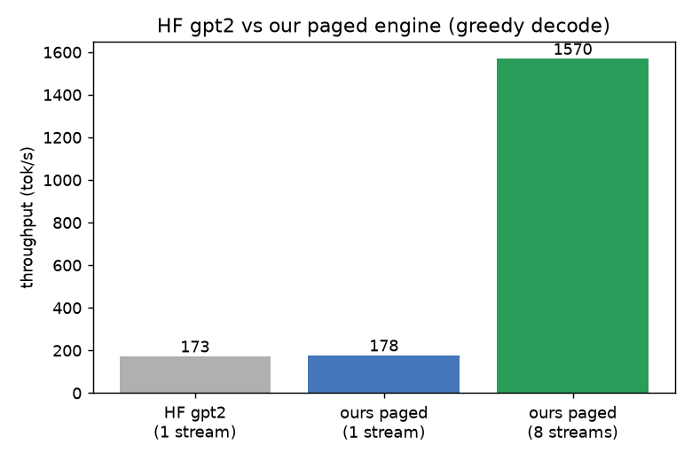

# mini-vllm

A from-scratch **LLM serving engine** — built to learn how vLLM / SGLang actually
work: continuous batching, paged KV cache, a custom attention kernel, and the
scheduler that ties them together. Runs real GPT-2 on an RTX 4080.

Not a fast production engine; a *legible* one. Every piece is built up in stages,
each one runnable and benchmarked, and validated against HuggingFace token-for-token.

Built after a toy KV-cache engine, reading/running nanoGPT, and a
[Triton softmax kernel](https://github.com/a-m-n-s/triton-softmax).

## What's here

| File | What |
|------|------|
| `workload.py` | synthetic request streams (controllable length + arrival distributions) |
| `sequential.py` | Stage 1 — one request at a time (throughput floor) |
| `static_batch.py` | Stage 2 — fixed batch; measures the idle-slot waste |
| `continuous.py` | Stage 3 — continuous/in-flight batching (evict + admit mid-flight) |
| `paged_kv.py` | block pool + block table + allocator (paged KV memory) |
| `paged_attention.py` | **Triton paged-attention decode kernel** + correctness test + benchmark |
| `gpt2.py` | our own GPT-2 forward (loads HF weights, matches HF exactly) |
| `paged_gpt2.py` | GPT-2 routed through paged KV + the kernel |
| `serve.py` | the full engine: continuous batching + paged KV + kernel + EOS |
| `bench.py` / `plots.py` / `profile_serve.py` | benchmarks, figures, profiling |

## The ideas, in order

**Batching is ~free until the compute knee.** Decode is memory-bound (every step
reloads the weights to make one token), so stacking sequences into a batch reuses
that one weight-load. Continuous batching keeps the batch full by evicting finished
sequences and admitting waiting ones mid-flight, instead of waiting for the slowest.



**Paged KV + a custom kernel removes the padding waste.** KV is stored in fixed
blocks (no per-sequence over-allocation, no fragmentation); a Triton kernel reads
those scattered blocks directly via a block table — no gather, no padding. The
advantage grows with length variance (real chat traffic).



**Own the model forward to route attention through your kernel.** GPT-2's weights
are open; we load them into our own forward so attention runs through the paged
kernel — exactly how vLLM integrates a model. Validated to match HF greedy output
token-for-token. Per-stream we match HF; at 8 concurrent streams continuous
batching + paging pull ahead of HF's own batched `generate`.



## Profiling finding

`profile_serve.py` shows decode is **91% of wall time**, and within it the **matmuls
dominate** (~79% of GPU time — the paged kernel is only ~4%). The loop is actually
**CPU-bound** (CPU time ≫ CUDA time): the GPU sits idle waiting on Python launch
overhead. That's the textbook case for CUDA graphs / fused kernels.

## Run

```bash
pip install torch triton transformers matplotlib
python bench.py            # sequential vs static vs continuous
python paged_attention.py  # kernel correctness + benchmark
python serve.py            # serve real prompts end to end
python plots.py            # regenerate the figures
python profile_serve.py    # profile the serving loop
```

(Needs a CUDA GPU. Developed in WSL2 on an RTX 4080.)

## Caveats (it's a learning engine)

fp32, single GPU, greedy decode, prefill uses plain attention (only decode is
paged). The point was to understand and build the serving machinery, not to beat
production engines — though the pieces are the real ones.
